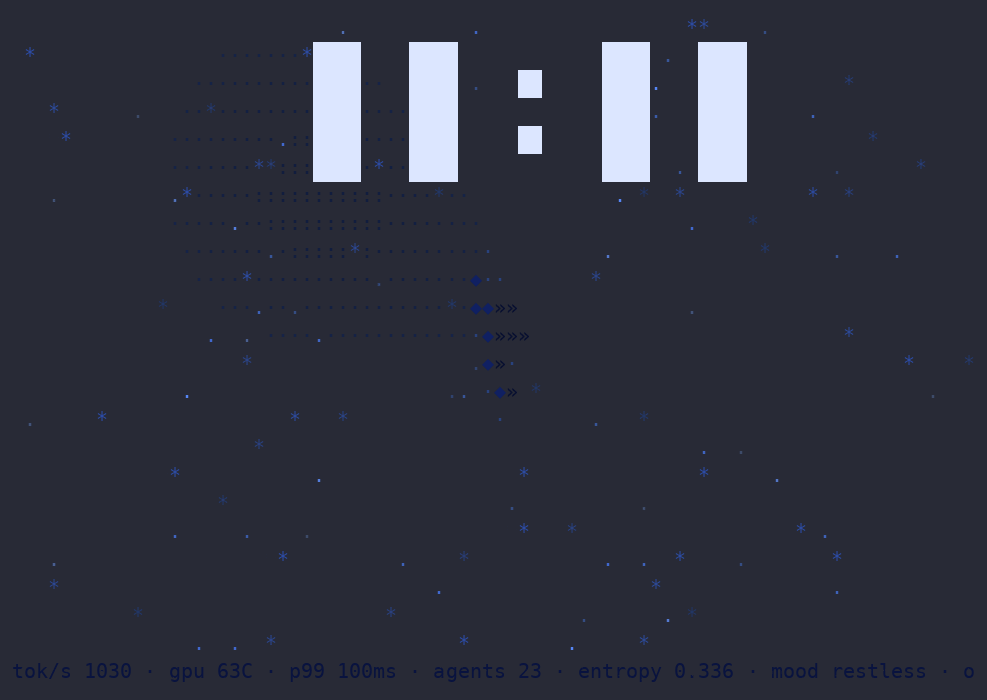

# phosphor

A truecolor, self-learning terminal screensaver with an optional password-protected lock mode. Rust + ratatui, local-first, LLM-optional.

## Quick start

Build and run the screensaver right now:

    git clone https://github.com/awdemos/phosphor.git
    cd phosphor
    cargo build --release
    ./target/release/phosphor --seed 42 --scripted --offline --no-learn --duration 10

Press any key to exit. Use your terminal's fullscreen key (e.g. F11) for the full effect.
In a headless/TMUX environment wrap the binary in `script` to allocate a TTY:

    script -qec "./target/release/phosphor --seed 42 --scripted --offline --no-learn --duration 10" /dev/null

## Install

Install from git with Cargo:

    cargo install --git https://github.com/awdemos/phosphor
    phosphor --seed 42 --scripted --offline --no-learn --duration 10

Or build from source:

    git clone https://github.com/awdemos/phosphor.git
    cd phosphor
    cargo build --release

The binary is then available at `./target/release/phosphor`.

## Modes

| mode | what it does |
|---|---|
| `orbital` | parallax starfield, orbital rings, nebula, block clock, telemetry ticker |
| `rain` | katakana/braille glyph rain with glitch bursts |
| `plasma` | demoscene plasma through morphing palettes |
| `pipes` | pipe walkers over a plasma floor |
| `generative` | re-themes itself from an LLM prompt (or offline hash-synthesis) |

`phosphor` (no args) runs `wander`: it rotates through modes on a learned schedule — it watches how long you linger, which palettes you keep, what you skip, and quietly re-weights what it shows you. All learning stays in `~/.local/share/phosphor/prefs.json`. `phosphor stats` shows what it learned; `phosphor forget` wipes it.

## Controls

A subtle menu bar is rendered at the bottom of the screen:

    [←→n] mode  [p] palette  [l] like  [d] dislike  [-] slower  [+] faster  [space] pause  [q] quit

| key | action |
|---|---|
| ← / → / n | switch mode (counts as a skip) |
| p | next palette |
| l | like current mode/palette (feeds the learner) |
| d | dislike current mode (rotates away and records a dislike) |
| - / + | slow down / speed up animation playback |
| space | pause/unpause the current mode (keeps the current style on screen) |
| q / Esc | exit |

When locked, only Backspace and Enter work; everything else is ignored.

## Options

    --mode MODE        orbital|rain|plasma|pipes|generative (default: wander)
    --prompt "TEXT"    theme for the generative mode
    --seed N           reproducible run (used for the demo recording)
    --fps N            frame cap (default 30)
    --duration SECS    auto-exit (used for recordings)
    --no-learn         don't write preference updates
    --offline          never call an LLM
    --scripted         deterministic fast-rotation showcase

## Lock mode

    PHOSPHOR_PASSWORD=s3cret phosphor lock
    # or (less secure — visible in ps):
    phosphor lock --password s3cret

This is a terminal novelty lock, not real encryption. While locked the screensaver runs behind an overlay; exit keys and mouse are ignored, Backspace edits the password, Enter submits, and the correct password removes the overlay. Without a configured password `phosphor lock` exits with an error.

## LLM hookup (optional)

The generative mode can ask a local LLM for fresh scene specs. It speaks OpenAI-compatible chat completions and auto-detects Ollama (:11434) and llama.cpp server (:8080), or use any endpoint:

    export PHOSPHOR_LLM_URL=http://localhost:11434/v1
    export PHOSPHOR_LLM_MODEL=llama3.2
    phosphor --mode generative --prompt "deep ocean phosphorescence"

With no endpoint reachable it falls back to a deterministic synthesizer seeded from your prompt — same prompt, same scene.

## How the learning works

Every mode rotation records dwell seconds (and palette dwell, skips, likes, dislikes) to a JSON file. Selection weights are smoothed dwell with exponential vote factors, so liked modes surface more and skipped modes fade — while every mode stays reachable. Nothing leaves your machine.

## Demo

`demo.cast` is the raw asciinema recording (10s, seeded); `demo.svg` the same thing in vector form. The exact command used to record it is:

    cargo build --release
    asciinema rec --overwrite -c "./target/release/phosphor --seed 42 --scripted --offline --no-learn --duration 10" demo.cast

## License

MIT — see [LICENSE](LICENSE).
